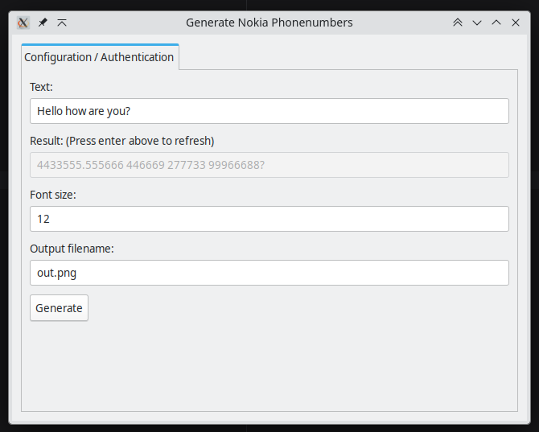

# phonenumber

Nokia keypad simulator and multi-tap encoding generator.

## 1. Project Purpose

This project provides a generator that translates text strings into their corresponding numeric key sequence as seen on classic mobile phones (often referred to as multi-tap keypad encoding). For example, typing "Hello" translates to the sequence `"4433555 555666"`. The project includes a CLI, a desktop GUI, and a Go library to generate both the string sequences and rendered images of the phone screen.

## 2. Screenshots & Sample Output

### Command Line Output Example


### Desktop GUI


## 3. CLI (`drawphonecli`)

The CLI application allows you to generate images directly from the terminal.

### How to Build
To build the CLI from source:
```bash
go build -o drawphonecli ./cmd/drawphonecli
```

### Flags and Options
- `-outfile`: The output filename for the generated image. (Default: `"out.png"`)
- `-text`: The text to convert and write to the image. (Default: `"Hello how are you?"`)
- `-fontsize`: The font size used for rendering the text. (Default: `12`)

### Examples
Generate an image with custom text:
```bash
./drawphonecli -text "Test message" -outfile "test.png" -fontsize 14
```

Using the default values:
```bash
./drawphonecli
```
*Outputs:*
```
'4433555.555666 446669 277733 99966688?'
Wrote: out.png
```

### Exit Behaviour
The CLI exits with `0` on success or if the help flag (`-h`) is requested. On error, it prints the error message to `stderr` and exits with code `1`.

## 4. Library Usage

You can use the multi-tap sequence generation logic in your own Go projects. The primary entry point is the `phonenumber.Convert` function.

### Conversion Semantics
- Spaces are mapped to `'0'` by default.
- Unknown characters (punctuation, unmapped symbols) are passed through literally.
- When two adjacent characters map to the same keypad key, a space (`' '`) pause is inserted between them by default.

### Preferred Public API
```go
package main

import (
    "fmt"
    "phonenumber"
)

func main() {
    text := "Hello"
    // Using default mapping (' ' -> '0' and ' ' pauses)
    seq := phonenumber.Convert(text)
    fmt.Println(seq) // Output: "4433555 555666"

    // Using configuration options
    seqOpts := phonenumber.Convert(text, phonenumber.WithIgnoreSpace(), phonenumber.WithDotPauses())
    fmt.Println(seqOpts)
}
```

### Configuration Options
- `WithIgnoreSpace()`: Retains literal spaces instead of mapping them to the Nokia `'0'` key. Takes precedence over `WithUnderscoreSpace()`.
- `WithUnderscoreSpace()`: Replaces spaces with underscores (`'_'`) instead of mapping to `'0'`.
- `WithDotPauses()`: Alters the pause character (inserted when adjacent characters map to the same keypad key, like "hi" mapping to `"44.444"`) from the default space (`' '`) to a dot (`'.'`).

### Compatibility & Deprecations
The `Numbers` function and legacy `Op*` constants (e.g., `OpIgnoreSpace`) are deprecated. Please migrate to `Convert` and the type-safe `Option` builders (`WithIgnoreSpace`, etc.). These deprecated endpoints are preserved for backward compatibility.

## 5. GUI (`drawphonegui`)

A simple graphical user interface to generate phone images.

### How to Build and Run
```bash
go build -o drawphonegui ./cmd/drawphonegui
./drawphonegui
```

### Supported Platforms
- **Linux** (amd64)
- **Windows** (amd64)

### Prerequisites and Limitations
- **macOS is NOT supported** by the GUI currently.
- **Linux Prerequisites**: Users of prebuilt GUIs need the GTK 3 runtime libraries. Developers building from source need the development packages (e.g., `libgtk-3-dev` and `build-essential` on Ubuntu).

## 6. Downloads & Releases

Pre-compiled binaries and packages are available on the [GitHub Releases page](https://github.com/arran4/phonenumber/releases).

### Architecture Support Matrix
- **CLI (`drawphonecli`)**: Available for Linux (amd64, armv6, armv7, arm64), Windows (amd64, arm64), and macOS (amd64, arm64).
- **GUI (`drawphonegui`)**: Available for Linux (amd64) and Windows (amd64).

### Archive Formats
- Linux and macOS archives are packaged as `.tar.gz`.
- Windows archives are packaged as `.zip`.

### Linux Packages
For convenient installation on Linux, we also publish prebuilt `.apk`, `.deb`, and `.rpm` packages.

## 7. Build from Source

### Requirements
- **Go**: Version `1.26.0` or higher is required.
- **C Compiler**: Required on Linux for GTK support.

### Representative Commands
Clone the repository and build:
```bash
git clone https://github.com/arran4/phonenumber.git
cd phonenumber
go build ./...
```

## 8. Troubleshooting

- **Linux GUI Fails to Start**: Ensure GTK 3 runtime dependencies are fully installed.
- **Permission Errors**: If the CLI cannot write `out.png`, check that you have write permissions in your current working directory.
- **Reporting Bugs**: If you encounter an issue or a bug, please file it on our [GitHub Issues](https://github.com/arran4/phonenumber/issues) page.

## 9. Development

To contribute or test your changes:

### Testing
We use standard Go testing. Note that GUI components are typically tested on Linux via `xvfb` or built headless.
```bash
go test ./... -v
```

### Vet and Linting
Run `go vet` to catch common mistakes:
```bash
go vet ./...
```
We also enforce strict linting using `golangci-lint`:
```bash
golangci-lint run
```

### Release Testing
To locally test the release pipeline without publishing:
```bash
goreleaser release --snapshot --clean -f .goreleaser-linux.yml
```

## 10. License

This project is licensed under the **GNU General Public License v3.0 (GPLv3)**.
For more details, see the [LICENSE](./LICENSE) file.
To contribute or view open issues, visit the [repository](https://github.com/arran4/phonenumber).
